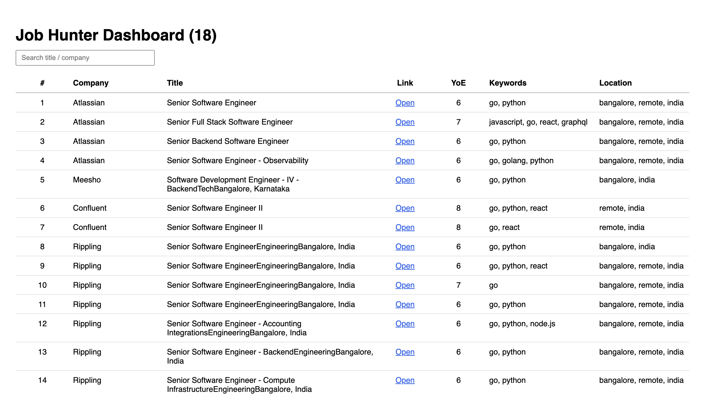

# Job Hunter CLI    

#### Steps to setup:
> git clone https://github.com/parasagrawal71/job-hunter.git 

> cd job-hunter 

> python3 -m venv venv   

> source venv/bin/activate 

> pip install -r requirements.txt   

> playwright install   

> pip install -e . 

     

#### Steps to run:
##### Testing  
> job-hunter --input input/companies_test.csv   

> Open frontend/index.html for dashboard (Run it with Live Server)  

##### Run it for all companies
> job-hunter --input input/companies.csv   

Note:
- Edit <a href="./job_hunter/config.py">job_hunter/config.py</a> for modifying filters as per your requirements
- Companies list: <code>./input/companies.csv</code>
- Output: <code>./jobs.csv</code>
- Error: <code>./jobs_error.csv</code>

   

#### Dashboard:

